# WorldCup 足球世界杯竞猜App

## 开发技术
使用 Vue 开发，兼容多平台 iOS、Android、Web。

## 主要功能
#### 一、新闻资讯
（快讯、球员、积分榜）
#### 二、竞猜类型
（独赢、让球、大小、波胆、冠军赛）
#### 三、教程内容
（可以添加）
#### 四、账户管理
（基础信息、支持短信或邮件验证、客户邀请等）
#### 五、积分管理
（加密钱包充提，积分充提）
#### 六、其它

## 联系
电报 (Telegram) [@iToken](https://t.me/TokenXX) 备注：世界杯APP

## 介绍

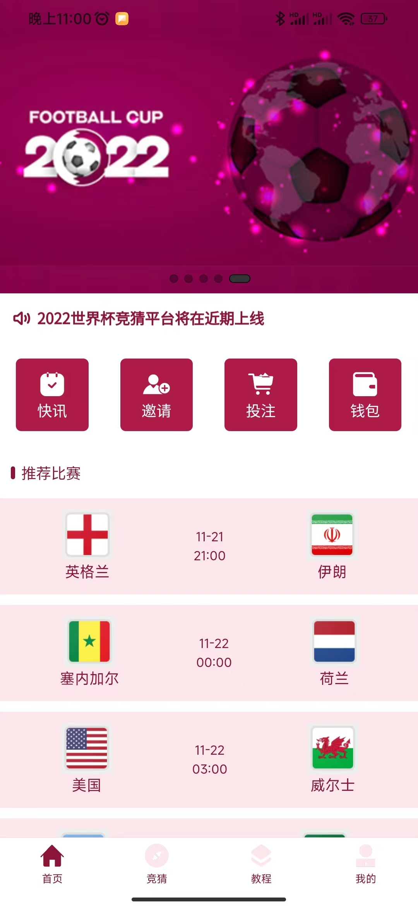      

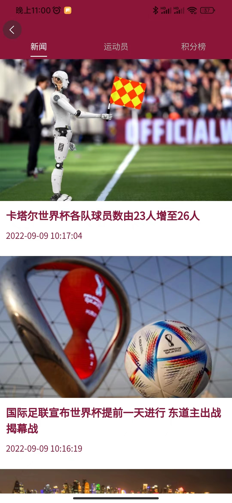

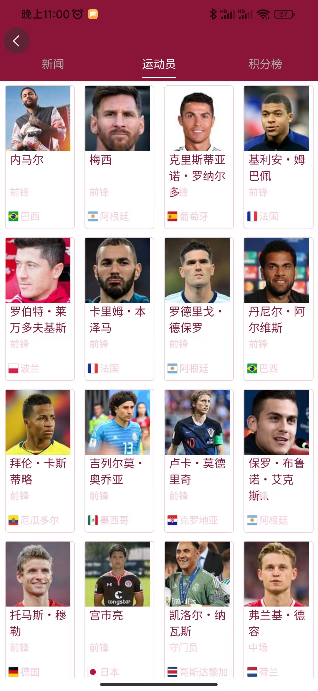      

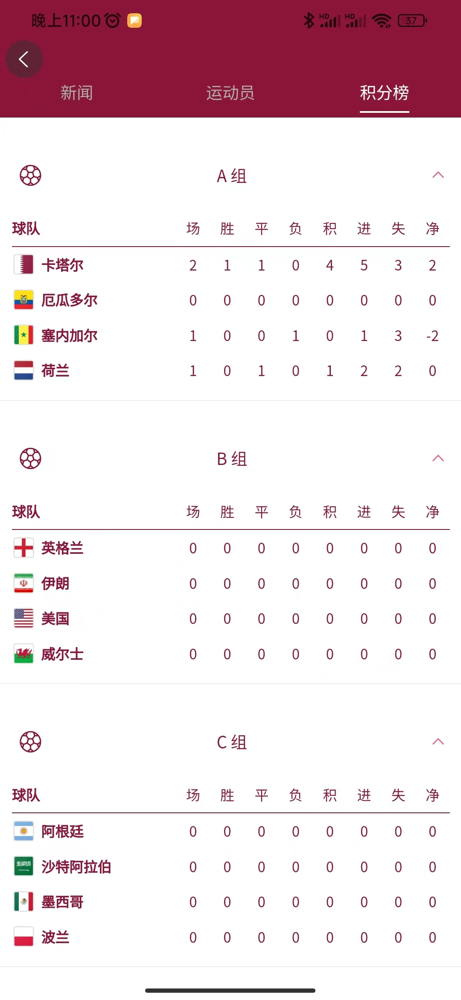

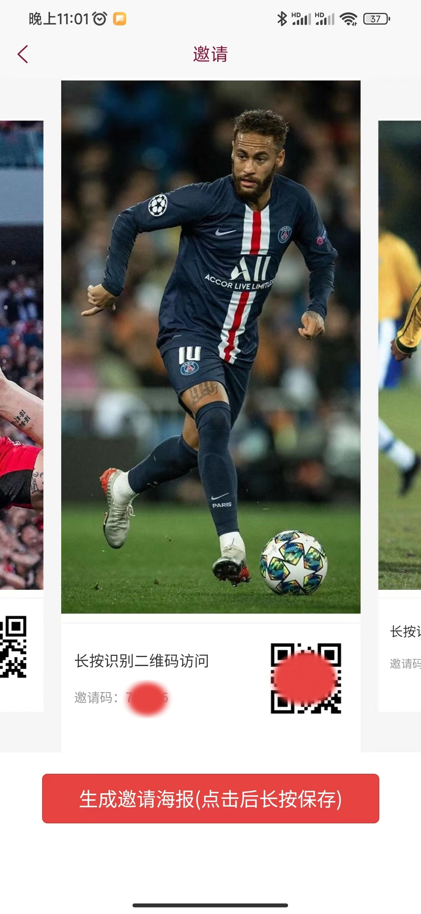      

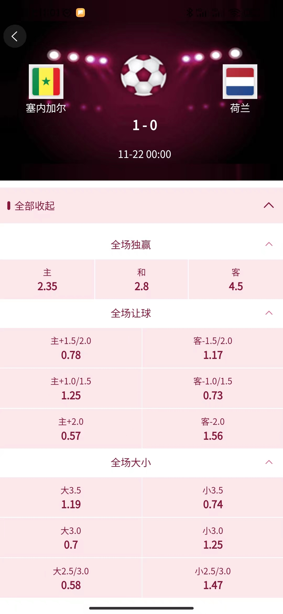

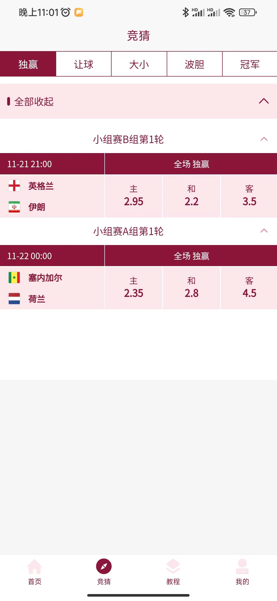      

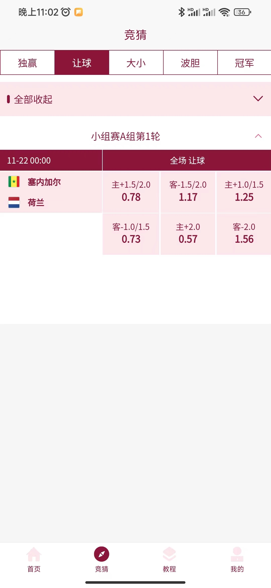

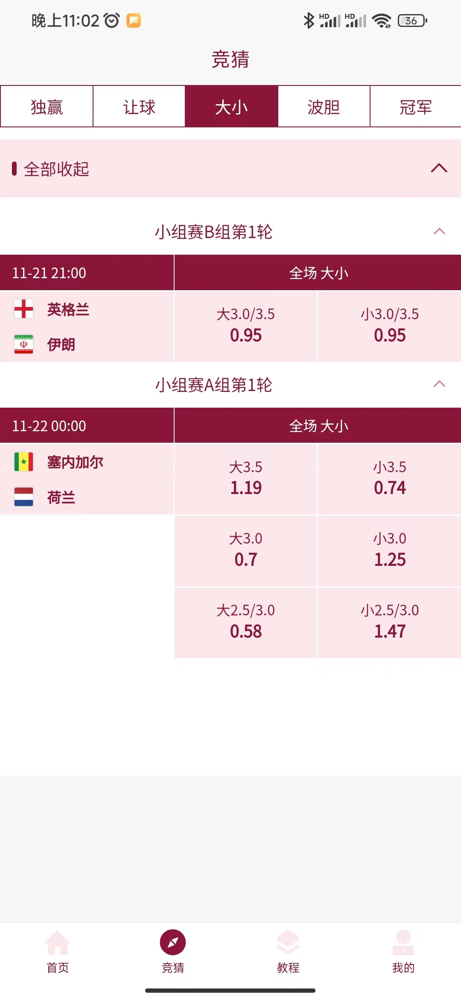      

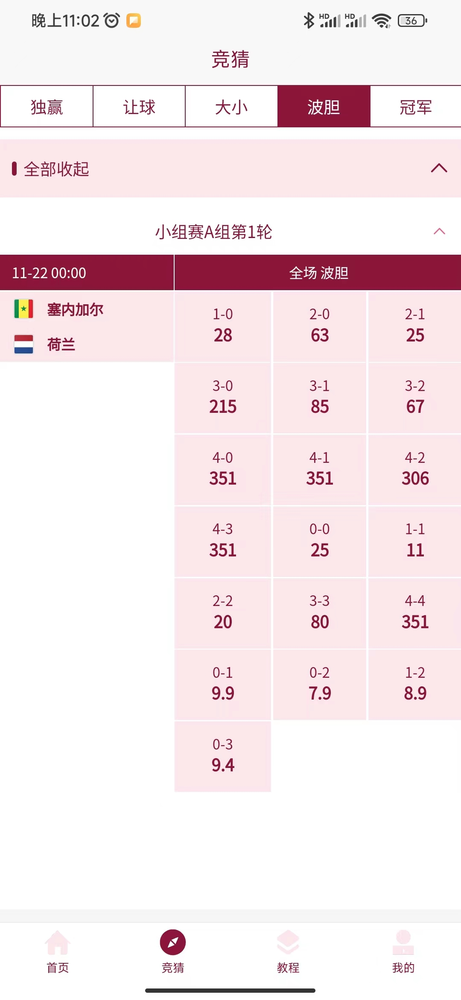

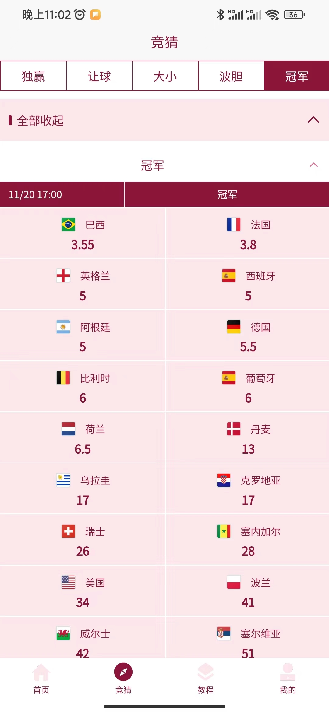      

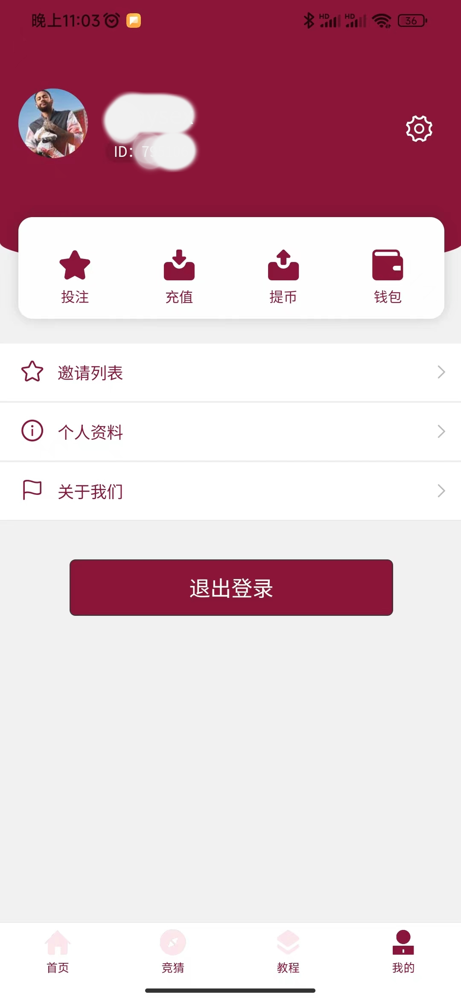

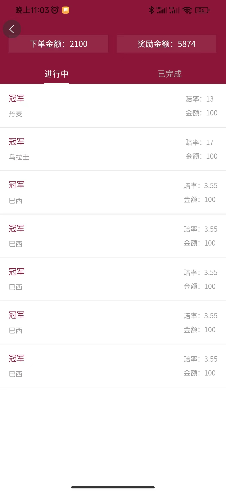      

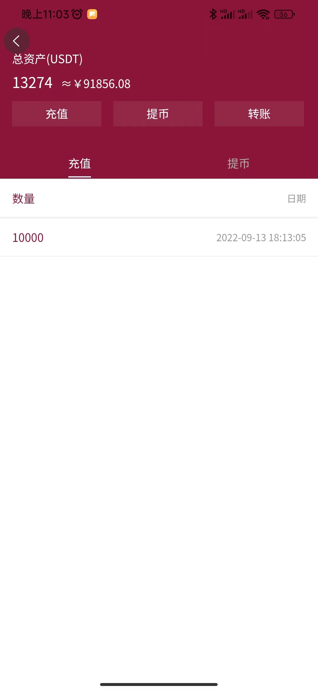

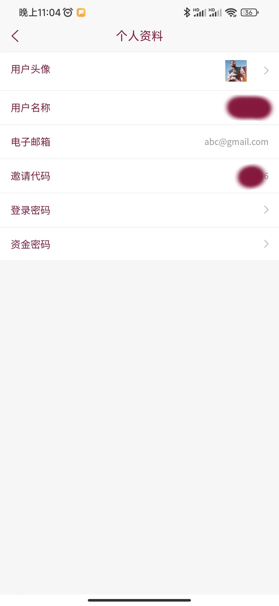 
